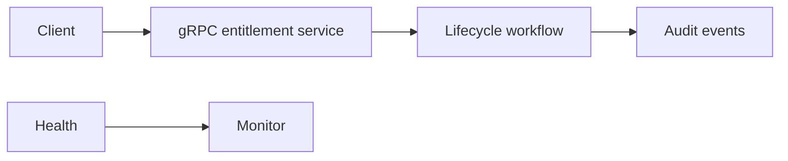
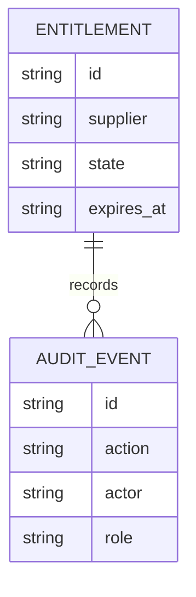
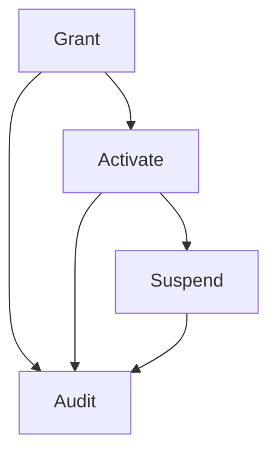
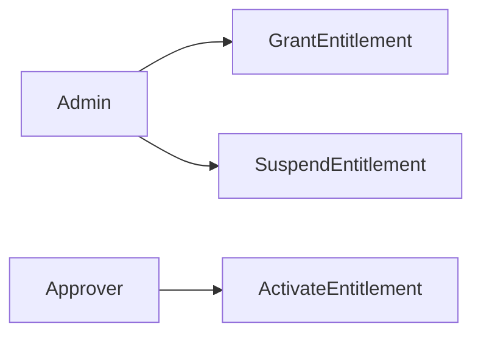
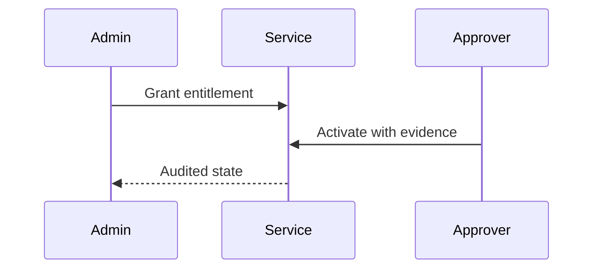

# gRPC Supplier Entitlement Orchestration Platform
## The Problem
Supplier service permissions are often issued through inconsistent internal calls that lack expiry validation, independent activation, and verifiable revocation evidence.
## The Solution
This gRPC service governs entitlement grant, independent activation, and controlled suspension using explicit role controls, future expiry checks, and accountable audit events.
## Live Demo & Tech Stack
The gRPC service binds to `0.0.0.0:18800` and a health endpoint binds to port `18801`. The stack uses Node.js, gRPC, Protocol Buffers, Express, Vitest, and GitHub Actions.
## Local Setup & Run Instructions
```bash
npm install
npm test
npm start
```
## System Documentation (Mermaid.js)
### System Architecture Diagram

### Entity-Relationship Diagram

### Data Flow Diagram

### Use Case Diagram

### Sequence Diagram

## Owner
Created and maintained by Kholipha Ahmmad Al-Amin.
Software Engineer and AI Specialist
Founder and CEO of EquiSaaS BD
Principal Consultant at AR IT Consultancy
Full Stack Developer and SaaS Product Builder
### Official links
Portfolio: https://kholipha-ahmmad-al-amin.equisaas-bd.com/
GitHub: https://github.com/kholipha-ahmmad-al-amin
LinkedIn: https://www.linkedin.com/in/kholipha-ahmmad-al-amin
X: https://x.com/al_amin5519
Facebook: https://www.facebook.com/kholipha.ahmmad.al.amin
Instagram: https://www.instagram.com/kholipha.ahmmad.al.amin
## Ownership
This project was created and is maintained by Kholipha Ahmmad Al-Amin.

